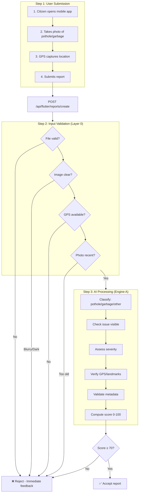

# StreetLight Civic Report System – Flow & Implementation

---

## System Flow Diagram



---

## Step 1: User Submission

| # | Action | Implementation |
|---|--------|----------------|
| 1 | **Citizen opens the mobile app** | Flutter app → `main.dart` → `HomeScreen`. User navigates via bottom nav. |
| 2 | **Takes a photo** (pothole or garbage) | `report_issue_screen.dart` → User taps upload box → `ImagePicker().pickImage(source: camera/gallery)` → `_imagePicker.pickImage()` |
| 3 | **GPS automatically captures location** | User taps "Tap to get your location" → `_getPreciseLocation()` → `Geolocator.getCurrentPosition(timeout: 15s)` → `placemarkFromCoordinates()` for address |
| 4 | **Submits the report** | User taps Submit → `_submitReport()` → `ApiService.createReport()` → multipart POST with image + `latitude`, `longitude`, optional `description` |

**Files:** `frontend/lib/screens/report_issue_screen.dart`, `frontend/lib/services/api_service.dart`

---

## Step 2: Input Validation (Layer 0)

**Purpose:** Quick quality checks before heavy AI processing.

| Check | Implementation | Threshold | User Feedback |
|-------|----------------|-----------|---------------|
| **Image clear enough?** (not blurry/dark) | `_check_blur()` – Laplacian variance<br>`_check_brightness()` – mean pixel intensity | Blur ≥ 50<br>Brightness 30–230 | "Image too blurry, please retake"<br>"Image too dark" |
| **GPS available and accurate?** | `_check_gps()` – validates within Pakistan bounds | lat 23–37, lon 60–78 | "Please enable location services" / "GPS coordinates required" |
| **File valid and not corrupted?** | `_check_file_valid()`, `_check_dimensions()` | Valid image, min 300×300, 10KB–10MB | "Invalid file" / "Resolution too low" |
| **Photo recent?** | `_check_timestamp()` – EXIF DateTime | Max 30 days old | "Photo is X days old. Please take a fresh photo." |

**File:** `backend/ai_layers/layer0_validation/input_validator.py`  
**Orchestrator:** `backend/utils/layer_orchestrator.py` → `input_validator.validate_all()`

**If failed:** Backend returns 400 with `errors` array → Frontend shows toast with message.

---

## Step 3: Parallel Processing – Engine A (AI Image Analysis)

**Purpose:** Once Layer 0 passes, AI processes the report.

| Function | Implementation | Output |
|----------|----------------|--------|
| **Identifies pothole or garbage** | ResNet18 CNN → softmax over 3 classes (pothole, garbage, other) | `predicted_class`, `confidence` |
| **Checks if issue is visible** | `confidence >= 50%` and `predicted_class != "other"` | `is_valid_issue` |
| **Assesses severity** | `_estimate_severity()` – contours, dark pixels, edges | small / medium / large |
| **Detects landmarks** | `GPSVerifier.verify_location()` – EXIF GPS vs submitted GPS, OpenStreetMap | `nearby_landmarks`, `verification_status` |
| **Validates metadata** | Layer 0 timestamp + EXIF in `exif_extractor.py` | Timestamp check |
| **Output: AI Confidence Score (0–100)** | `confidence * 100` + GPS adjustment (penalty/bonus) | `final_score` |

**Example:** Photo clearly shows a large pothole → AI gives 92/100 score.

**Files:** `backend/ai_layers/layer1_ai_engine/ai_engine.py`, `backend/ai_layers/layer1_ai_engine/landmark_detector/verifier.py`

---

## End-to-End Flow (Simplified)

```
[User] → [Report Issue Screen] → [Submit] → [API] → [Layer 0] → Pass? → [Layer 1 AI] → [Accept/Reject]
                                         ↓
                                    Fail? → 400 + toast
```

---

## File Reference

| Component | File |
|-----------|------|
| Report UI & submit | `frontend/lib/screens/report_issue_screen.dart` |
| API client | `frontend/lib/services/api_service.dart` |
| Report creation | `backend/routers/flutter/mobile_auth.py` |
| Layer orchestrator | `backend/utils/layer_orchestrator.py` |
| Layer 0 validation | `backend/ai_layers/layer0_validation/input_validator.py` |
| Layer 1 AI engine | `backend/ai_layers/layer1_ai_engine/ai_engine.py` |
| GPS verifier | `backend/ai_layers/layer1_ai_engine/landmark_detector/verifier.py` |
